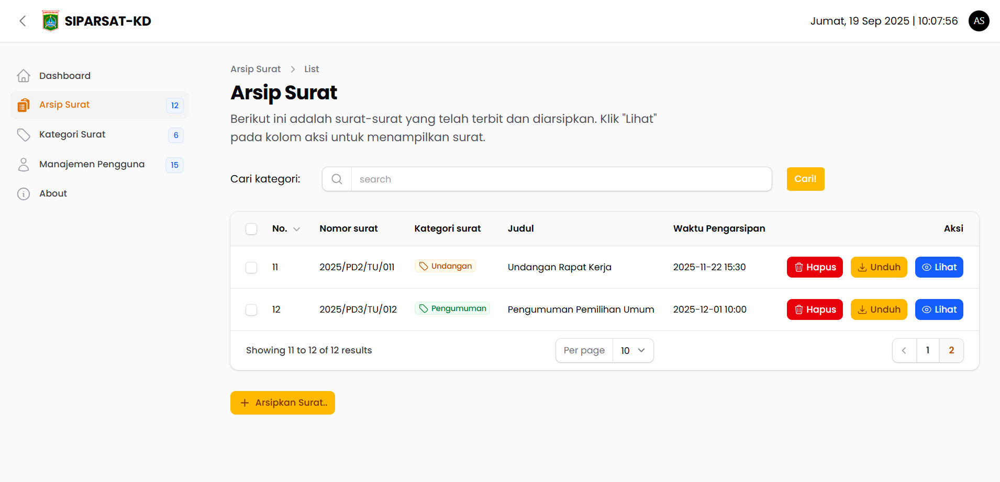
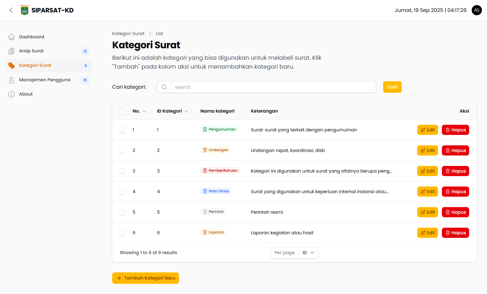
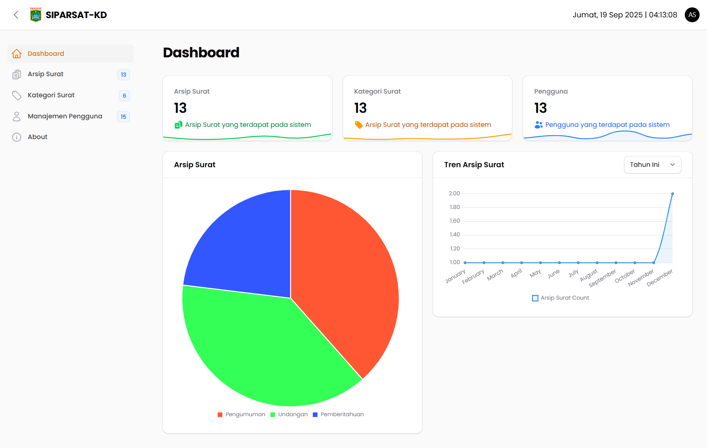
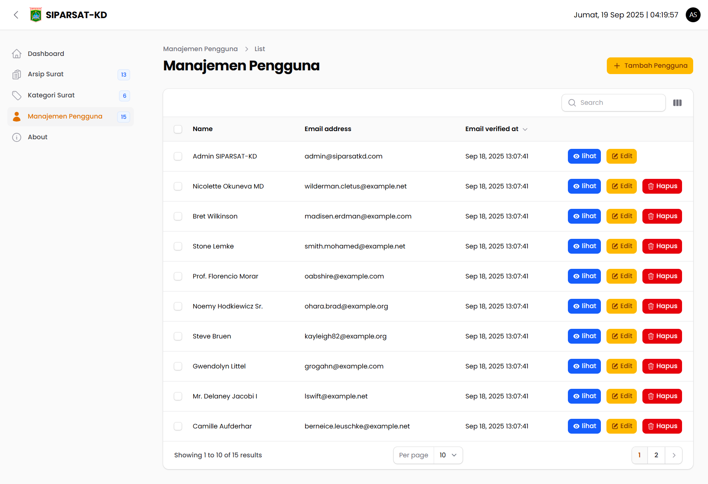

# SIPARSAT-KD

<p align="center"><a href="https://siparsat-kd.daintyc.xyz" target="_blank"></a></p>

<div align="center">
    
  

[](https://siparsat-kd.daintyc.xyz/)

Aplikasi berbasis web yang dirancang khusus untuk membantu perangkat Desa Karangduren dalam mengelola, menyimpan, dan mengarsipkan surat-surat resmi secara digital dengan efisien dan terorganisir.

</div>

<div align="center">


</div>


## Tujuan

Aplikasi ini bertujuan untuk mengelola arsip surat secara digital, mempermudah pencarian, pengelompokan, dan penyimpanan
surat dengan aman.

## Fitur

- **Manajemen Arsip Surat**: Tambah, edit, hapus, dan lihat arsip surat.
- **Kategori Surat**: Tambah, edit, hapus kategori surat
- **Pencarian Surat**: Cari surat berdasarkan kata kunci.
-  **Pencarian Kategori Surat**: Cari kategori surat berdasarkan kata kunci.
- **Upload File**: Simpan file surat dalam format PDF.
- **Dashboard (Additional)**: Stats dan analitik.
- **Manajemen Pengguna (Additional)**: Tambah, edit, hapus, dan lihat pengguna.

## Cara Menjalankan

1. Clone repository ini:
   ```bash
   git clone "https://github.com/rrdentin/siparsat-kd.git"
   ```
2. Masuk ke direktori proyek:
   ```bash
   cd siparsat-kd
   ```
3. Install dependensi menggunakan Composer:
    ```bash
       composer install
       php artisan key:generate
    ```
4. Salin file `.env.example` menjadi `.env` dan sesuaikan konfigurasi database.
5. Jalankan migrasi database atau gunakan file siparsat-kd.sql:
   ```bash
   php artisan migrate --seed
   ```
6. Jalankan aplikasi dengan perintah:
   ```bash
    php artisan serve
    ```
   
## Screenshot
1. Halaman Arsip Surat
   
2. Halaman Kategori Surat
   
3. Halaman About
   
4. Halaman Dashboard (Additional)
   
5. Halaman Manajemen Pengguna
   


# Author
<p align=”center”>

<a href="https://www.daintycube.my.id/" target="_blank">
  
</a>
</p>
